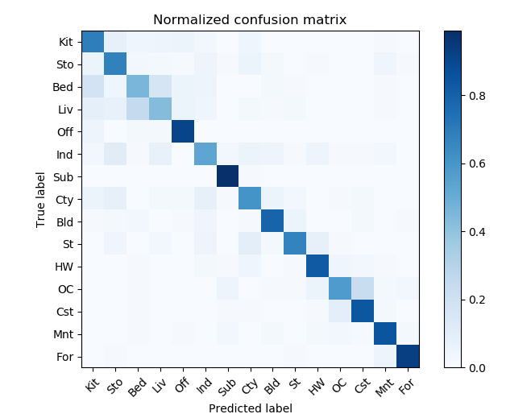

<center>
<h1>Project 3 results visualization</h1>


## Overview
The project is related to 
> KNN classification and linear SVMs for multi-class classification


## Implementation
1. Build a tiny image feature
	* Cut the images to square, and resize to the smaller ones. 
	* Zero mean and unit length normalization to the features.
	
```python
    #Zero mean unit length normalization
    tiny_images_T = tiny_images

    for idx, feature in enumerate(tiny_images_T):
        feature_scaled = preprocessing.scale(feature,with_std = True)
        # feature_scaled = feature_scaled/np.max(abs(feature_scaled))
        tiny_images[idx,:] = feature_scaled
```
2. Bags-of-sifts feature
	* Build up the vocabulary for training and testing dataset.
	* Sample the descriptors and the cluster to the center with kmeans.
3. Get bags of sifts
	* Extract the descriptors for specific step number.
	* Calculate the distances between the vocabulary and the descriptors.
	* Choose the minimum distance for the each descriptor and build up the histogram.
4. KNN
	* Calculate the euclidean distance between the training image features and the testing image features
	* Count the first K small distances' label, the most one is the prediction.
5. Linear SVM
	Using LinearSVC function to predict the output labels. We can modify the C value to get the best result with different step when we build the vocab.


## Installation
* Other required packages.
	* Install Anaconda and get the packages inside.
	* conda install -c menpo cyvlfeat

* How to compile from source?
	* activate the environment which include the packages used in this project
	* Use command line type "python proj3.py --feature=? --classifier=?", and it can compile the source.
	* Feature can choose "tiny_image" or "bag_of_sift"
	* Classifier can choose "nearest_neighbor" or "support_vector_machine"
	
### Results
1. **tiny-images**  x  **KNN**(K=1) :  0.2307
2. **tiny-images**  x  **linear SVM**(C=0.0004) : 0.2174
3. **bags-of-sifts**  x  **KNN**
	* Step=[5,5], K=1: 0.5020
	* Step=[5,5], K=5: 0.5374
	* Step=[3,3], K=1: 0.5027
	* Step=[3,3], K=5: 0.5514
4. **bags-of-sifts**  x  **linear SVM**
	* Step=[5,5], C=0.00003 : 0.7047
	* Step=[3,3], C=0.000004 : 0.7194

### Confusion matrix


<br>Use **bags-of-sifts**(Step=[3,3])  x  **linear SVM**(C=0.000004)</br>
<br>Accuracy (mean of diagonal of confusion matrix) is 0.7194</br>

<p>

## Visualization
| Category name | Sample training images | Sample true positives | False positives with true label | False negatives with wrong predicted label |
| :-----------: | :--------------------: | :-------------------: | :-----------------------------: | :----------------------------------------: |
| Kitchen |  |  |  |  |
| Store |  |  |  |  |
| Bedroom |  |  |  |  |
| LivingRoom |  |  |  |  |
| Office |  |  |  |  |
| Industrial |  |  |  |  |
| Suburb |  |  |  |  |
| InsideCity |  |  |  |  |
| TallBuilding |  |  |  |  |
| Street |  |  |  |  |
| Highway |  |  |  |  |
| OpenCountry |  |  |  |  |
| Coast |  |  |  |  |
| Mountain |  |  |  |  |
| Forest |  |  |  |  |


